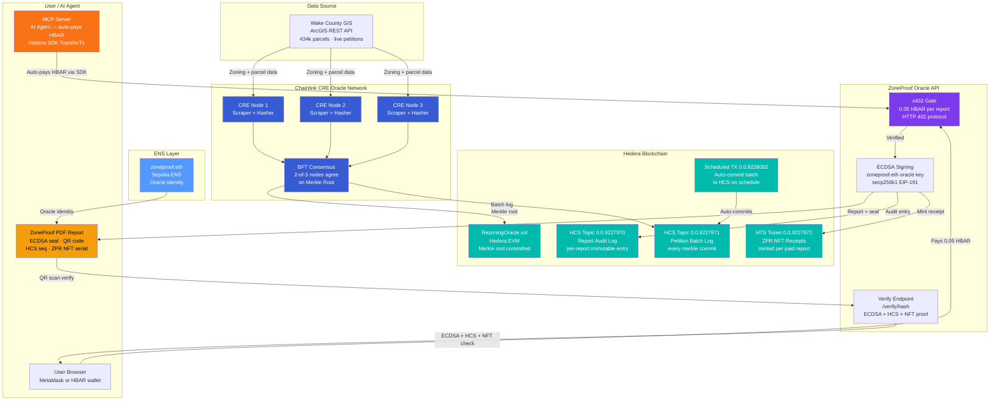

<div align="center">
  
  <h1>ZoneProof</h1>
  <p><strong>Decentralized Land Registry & Due Diligence Protocol</strong></p>
  <p>
    <a href="https://hashscan.io/testnet/topic/0.0.9227970">HCS Topic</a> ·
    <a href="https://hashscan.io/testnet/token/0.0.9227972">ZPR NFT</a> ·
    <a href="https://hashscan.io/testnet/schedule/0.0.9228002">Scheduled TX</a> ·
    <a href="https://hashscan.io/testnet/contract/0xf3f8945df31ac04c09312e9e472ba7415bf356b4">Oracle Contract</a>
  </p>
  <p>
    
    
    
  </p>
</div>

---

## The Problem

Web3 players — companies like **RealT**, **Propy**, **Landshare**, and **Centrifuge** — that want to **tokenize a parcel of land** or **lend capital against a real estate project** currently pay **$12,000 to $20,000 per transaction** to third-party vendors just to perform due diligence. The root cause: zoning history, petition records, and parcel data are siloed at the county level, unstructured, and require manual aggregation.

> _A Web3 lender trying to underwrite a $2M land loan spends weeks and thousands of dollars pulling fragmented records from county portals — before a single token is minted._

---

## The Solution — ZoneProof

ZoneProof aggregates county-level zoning data via **Chainlink CRE** oracle nodes, turns that data into a cryptographically verifiable **Zoning Oracle**, and anchors every change on **Hedera**. When a due diligence report is generated, it is cryptographically signed by **zoneproof.eth** and permanently logged on HCS — so any party can verify its authenticity in seconds, not weeks.

**Impact:**
- Web3 lenders and land tokenizers skip the $12K–$20K vendor process
- Any report can be verified in < 5 seconds by scanning the QR code on the PDF
- Every piece of zoning history is on-chain, tamper-proof, and publicly auditable

---

## Who Benefits

| Company | Type | Use Case |
|---|---|---|
| **RealT** | Land tokenization | Verify zoning status before minting fractional tokens |
| **Propy** | Blockchain real estate | Attach verifiable zoning history to property NFTs |
| **Landshare** | RWA tokenization | Due diligence on land parcels before tokenization |
| **Lofty.ai** | Fractional real estate | Confirm permitted uses and rezoning risk |
| **Maple Finance** | DeFi lending | Underwrite real estate loans with on-chain zoning proof |
| **Centrifuge** | RWA lending | Verify collateral zoning status before origination |
| **Goldfinch** | Undercollateralized lending | Real-world collateral due diligence |
| **TrueFi** | On-chain credit | Land parcel verification for real estate credit lines |

---

## Architecture



---

## Hedera

ZoneProof uses Hedera at every layer — no Solidity, no smart contracts for the core oracle logic.

### Hedera Consensus Service (HCS)
Every time a due diligence report is generated, a timestamped message is written to the **Report Audit Topic** (`0.0.9227970`) containing the report hash, oracle address, and property PIN. This creates a public, immutable audit trail that any third party can verify independently on HashScan — without trusting ZoneProof.

Every zoning petition batch is also logged to the **Petition Batch Topic** (`0.0.9227971`), anchoring the full history of what data entered the merkle tree.

- Report Audit Topic: [0.0.9227970](https://hashscan.io/testnet/topic/0.0.9227970)
- Petition Batch Topic: [0.0.9227971](https://hashscan.io/testnet/topic/0.0.9227971)

### Hedera Token Service (HTS)
When a user pays for a ZoneProof report via x402, a **ZPR NFT** is minted on HTS (`0.0.9227972`). The NFT metadata encodes the report hash (`zpr:0x...`), creating an on-chain receipt that proves the report was purchased and issued. No smart contract. No Solidity. Pure Hedera SDK.

- ZPR Token: [0.0.9227972](https://hashscan.io/testnet/token/0.0.9227972)

### Scheduled Transactions
ZoneProof uses `ScheduleCreateTransaction` to schedule future HCS petition batch commits — demonstrating autonomous on-chain automation without human trigger.

- Example Scheduled TX: [0.0.9228002](https://hashscan.io/testnet/schedule/0.0.9228002)

### x402 Payments
Every report download is gated by an HTTP 402 response. The client pays **0.05 HBAR** to the ZoneProof oracle wallet and retries with the transaction ID in an `X-Payment` header. The middleware verifies the payment on the Hedera Mirror Node before serving the report.

### AI Agent Payments (MCP Server)
The **ZoneProof MCP Server** exposes parcel query tools to any MCP-compatible AI (Claude, etc.). When the agent receives a 402, it autonomously constructs and submits a `TransferTransaction` using the **Hedera JS SDK** — no human action required.

**SDK used:** `@hashgraph/sdk` — `Client`, `AccountId`, `PrivateKey`, `Hbar`, `TransferTransaction`, `TopicCreateTransaction`, `TopicMessageSubmitTransaction`, `TokenCreateTransaction`, `TokenMintTransaction`, `ScheduleCreateTransaction`

---

## Chainlink CRE

ZoneProof uses **Chainlink CRE (Compute Runtime Environment)** to turn raw county data into a trustless Zoning Oracle.

Three independent CRE nodes scrape Wake County's ArcGIS REST API on a schedule, hash each rezoning petition and parcel change into a SHA-256 Merkle tree, and reach **Byzantine Fault Tolerant (BFT) consensus** — 2-of-3 nodes must agree on the same Merkle root before it is committed to the RezoningOracle contract on Hedera EVM.

This means ZoneProof has **no single point of failure**: no one node can corrupt the zoning history. The Merkle root is the cryptographic fingerprint of every petition ever recorded — and it lives on-chain.

- Oracle Contract: [`0xf3f8945df31ac04c09312e9e472ba7415bf356b4`](https://hashscan.io/testnet/contract/0xf3f8945df31ac04c09312e9e472ba7415bf356b4)

---

## ENS

The ZoneProof oracle is identified by its ENS name: **`zoneproof.eth`** (registered on Sepolia).

Every generated PDF report is signed with an **ECDSA key** (secp256k1 / EIP-191) whose corresponding Ethereum address is resolvable by looking up `zoneproof.eth`. The report contains the oracle's ENS name, address, a report hash, and a QR code linking to `/verify/{hash}`.

Anyone can verify a ZoneProof report:
1. Scan the QR code on the PDF → opens `/verify/{hash}`
2. The page resolves `zoneproof.eth` → gets oracle address
3. Recovers the signer from the ECDSA signature
4. Confirms they match → **Authentic ZoneProof Report**
5. Shows the HCS sequence number and ZPR NFT serial as additional proof layers

---

## The Full Due Diligence Flow

```
1. User types a property address or PIN on the ZoneProof map
2. Map shows all rezoning petitions on the parcel (free preview)
3. User pays 0.05 HBAR via x402 to unlock the full report
4. Oracle signs the report with zoneproof.eth ECDSA key
5. Report is logged to Hedera HCS (immutable timestamp)
6. ZPR NFT is minted on HTS as a receipt
7. User downloads a PDF with ECDSA seal + QR code
8. Any counterparty scans the QR → verifies authenticity in < 5 seconds
```

Instead of a $12,000–$20,000 vendor process taking weeks — **verified in seconds, for cents.**

---

## Setup

### Prerequisites
- Node.js 18+
- Python 3.9+
- Hedera Testnet account with HBAR

### 1. Clone and configure
```bash
git clone https://github.com/your-org/zoneproof
cd zoneproof
cp oracle/.env.example oracle/.env
# Fill in HEDERA_ACCOUNT_ID, HEDERA_PRIVATE_KEY, DB credentials
```

### 2. Start the Hedera sidecar (HCS + HTS)
```bash
cd oracle/hedera
npm install
node service.mjs
# Runs on :8002
```

### 3. Start the Oracle API
```bash
cd /path/to/zoneproof
pip install -r oracle/requirements.txt
python3 -m uvicorn oracle.api.main:app --reload --port 8001
```

### 4. Start the frontend
```bash
cd app
npm install
npm run dev
# Opens on :5173
```

### 5. (Optional) MCP Server for AI Agents
```bash
cd oracle/mcp
npm install
node server.js
```

### Environment Variables
| Variable | Description |
|---|---|
| `HEDERA_ACCOUNT_ID` | Hedera testnet account (e.g. `0.0.7952768`) |
| `HEDERA_PRIVATE_KEY` | ECDSA private key (hex) |
| `HEDERA_EVM_ADDRESS` | EVM address of the oracle |
| `ORACLE_ENS` | ENS name (`zoneproof.eth`) |
| `HCS_REPORT_AUDIT_TOPIC` | HCS topic ID for report audit |
| `HCS_PETITION_LOG_TOPIC` | HCS topic ID for petition batches |
| `HTS_NFT_TOKEN_ID` | HTS token ID for ZPR NFT receipts |
| `HEDERA_SERVICE_URL` | Hedera sidecar URL (default `http://localhost:8002`) |

---

## Tech Stack

| Layer | Technology |
|---|---|
| Data oracle | Chainlink CRE (3-node BFT consensus) |
| Blockchain | Hedera EVM, HCS, HTS, Scheduled Transactions |
| Payments | x402 protocol (0.05 HBAR per report) |
| Identity | ENS (`zoneproof.eth` on Sepolia) |
| AI agent | Hedera MCP Server (autonomous HBAR payments) |
| Backend | FastAPI (Python), `eth-account` (ECDSA) |
| Frontend | React, Vite, Mapbox GL JS, jsPDF |
| Database | Supabase (434k Wake County parcels, 2k+ petitions) |

---

<div align="center">
  <sub>Chainlink CRE · Hedera · ENS</sub>
</div>